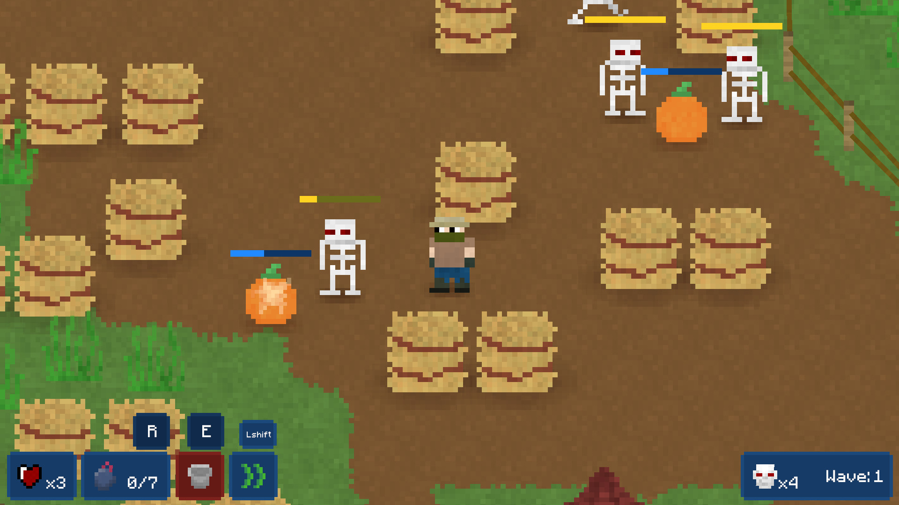

# PEPO
A small game I made for a self-imposed Halloween Game Jam.

Here's what you need to know:
You are a pumpkin farmer whose pumpkins are under attack by wave after wave of skeletons. It is your job to defend the pumpkins at any cost.

The pumpkins act as your lives and should all of them be eaten, you will die. All is not lost should a pumpkin perish, for you can water it until it becomes a pumpkin again and you will restore one of your lives.

# [DOWNLOAD](https://github.com/Weeaboo420/Pepo/raw/master/Build/Pepo.zip)